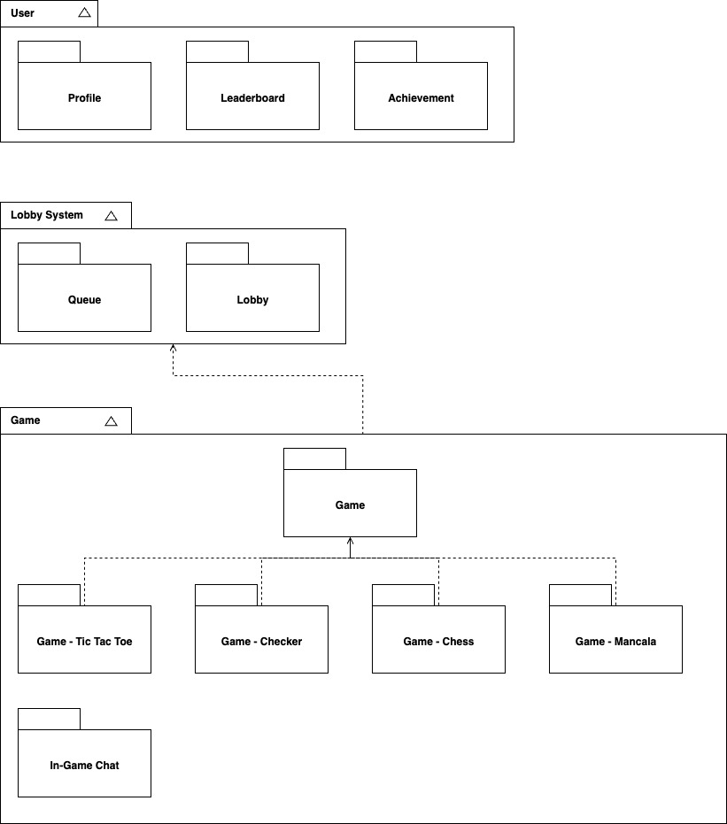
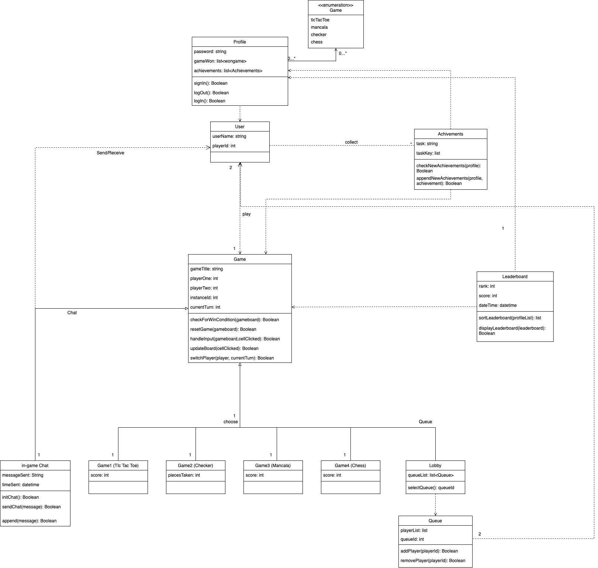
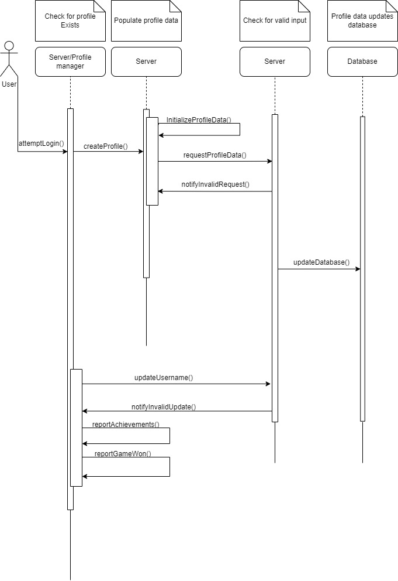
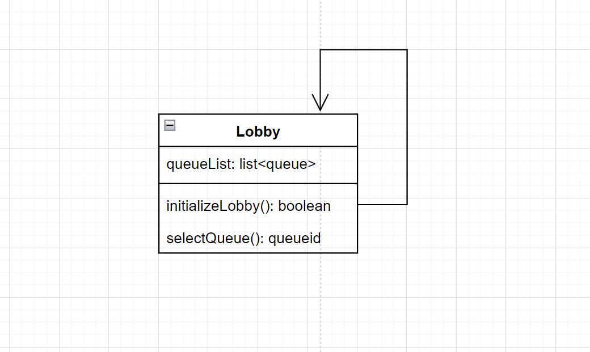

# Description
We aim to address the problem that there is a lack of convenient and inclusive ways to game with other gamers. The Impact of this is a disconnected group of gamers. For gamers who need an online platform to connect with others, GameyTime will be an online gaming platform that is an extremely convenient method for connecting with other gamers. Unlike other platforms that require you to download extra software or create an online account, our product will make it easier and faster for all gamers to game together. We will deliver a fast, easy-to-navigate, and efficient browser-based gaming website that will include a wide variety of games for free. The website is easily accessible by any type of person of any age and will allow multiple people to quickly connect and play together online. Our intended audience/consumer is casual gamers of any age who also have access to an internet connection and are looking to play a casual game with someone else online.
 
Users will connect to the website by inputting the link www.gameytime.me into a browser. Users will have the option to create a profile on the website which will store the user rankings, games ratings, and achievements, or create a temporary username to quickly play any game offered by our site. Users will select a single game lobby to join from a variety of possible games, which will include tic-tac-toe, checkers, mancala, and other tabletop games. Once a user selects a game lobby, they will be placed into a queue. Users will wait in a game specific queue until they can be paired with the appropriate number of players needed. Users have the option to send a message through the use of an in-game chat, by typing any string into the chat box. In-game chat will be moderated to ensure a clean dialog between users. Users with a profile will able to look at their game statistics and aquired achievements. The landing page will display a leaderboard containing rankings from other users with profiles. The user interface will be simple and clean.

# Architecture

# Class diagram

# Sequence diagram

## Use Case Description
**Use Case:** User Creates an account/profile  
**Actor:** User  
**Description:** User attempts to create/access a profile with provided user data (username and profile)  
**Preconditions:** User is connected to server  
**Postconditions:** User will have a profile assigned to their username  
**Main Flow:**  
- User will travel to login page
- User will choose to create a new account
- Server will initialize user data to default values
- User will provide username and password
- Server will verify proper data input
- Database will be updated with new profile  
  
**Alternative Flow:**  
- User already has an account
  - User can view profile data
  - User can update attempt to update username
- User provides bad username or password
  - Server will notify user of bad input
  - Server will redo request for proper input

# Design Patterns
Split this section into 2 subsections. For each subsection, present a UML class diagram showing the application of a design pattern to your system (a different pattern for each section). Each class diagram should contain only the classes involved in the specific pattern (you don’t need to represent the whole system). Choose patterns from two different categories: Behavioral, Structural, and Creational. You are not limited to design patterns studied in class. 

Your system may not be appropriate for any design pattern. In this case, for didactic purposes, be creative and extend a little bit the scope of your system to make the design patterns appropriate. 

Implement each design pattern in your system and provide GitHub links to the corresponding classes

## Below is the singleton design pattern class diagram. It is very simple, as the lobby class can only have a single instance running at any given time.

Grading criteria (6 points, 3 each pattern): Correct use of the design pattern as described in the literature; Adequate choice of the design pattern; Adequate implementation of the design pattern.

# Design Principles
How does your design observe the SOLID principles? Provide a short description of followed principles giving concrete examples from your classes. 

Grading criteria (6 points): Show correct understanding of SOLID principles; Provide enough details to justify how the principles were observed.
